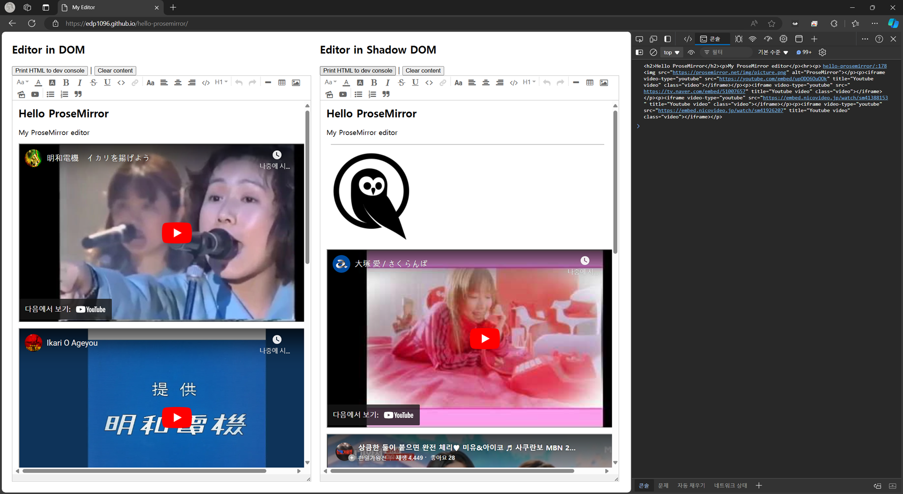

# Taste ProseMirror




[Demo](https://edp1096.github.io/hello-prosemirror)

## Usage
See [index.html](index.html)

## CDN
* https://cdn.jsdelivr.net/gh/edp1096/hello-prosemirror/dist/myeditor.js
* https://cdn.jsdelivr.net/gh/edp1096/hello-prosemirror/dist/myeditor.mjs
* https://cdn.jsdelivr.net/gh/edp1096/hello-prosemirror/dist/myeditor.mjs.map
* https://cdn.jsdelivr.net/gh/edp1096/hello-prosemirror/dist/myeditor.css

## Build

```powershell
yarn all # All
yarn js  # Browser JS
yarn mjs # Module
yarn css # CSS
```

## Watch

* Browser JS
```powershell
yarn watch     # JS as default
yarn watch mjs # MJS
yarn watch js  # JS
```

## Run Uploader server
```powershell
cd watchplace/uploader
go run .
```

## Source
* https://prosemirror.net/examples/basic
* https://github.com/ProseMirror/prosemirror-example-setup
